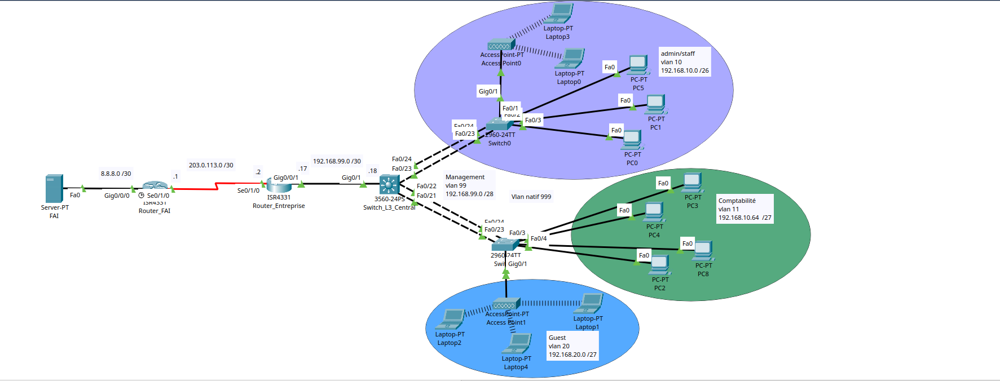
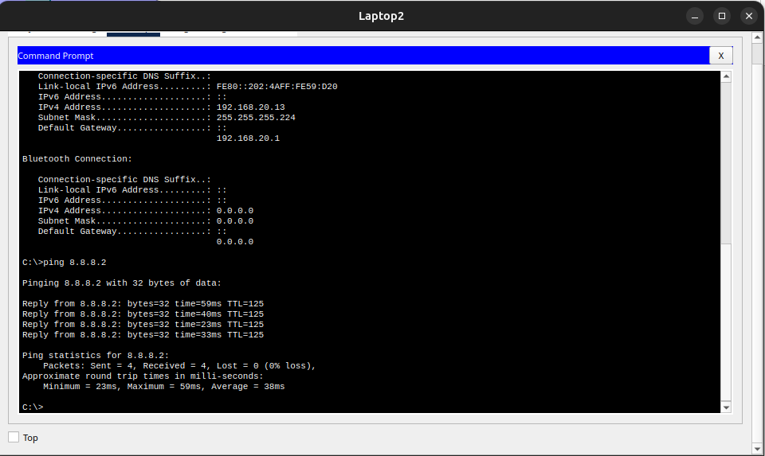
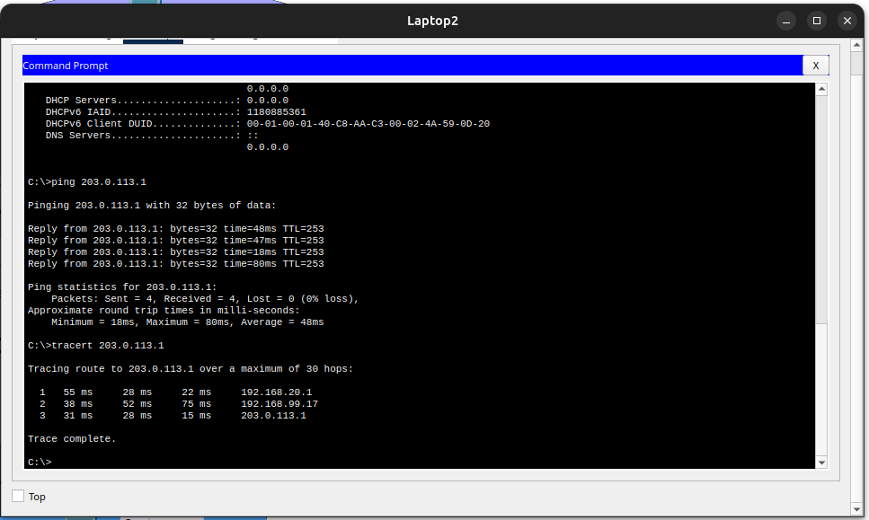
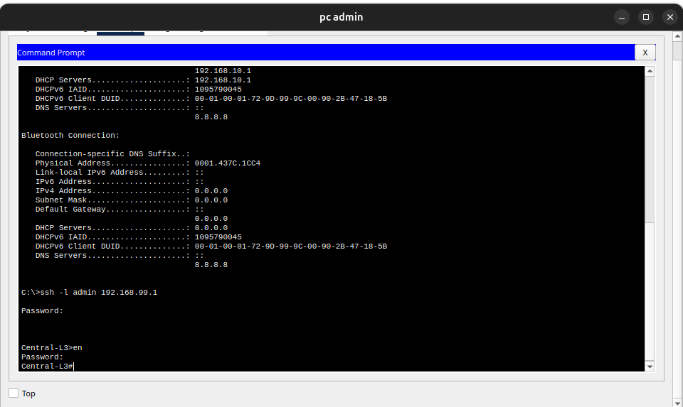
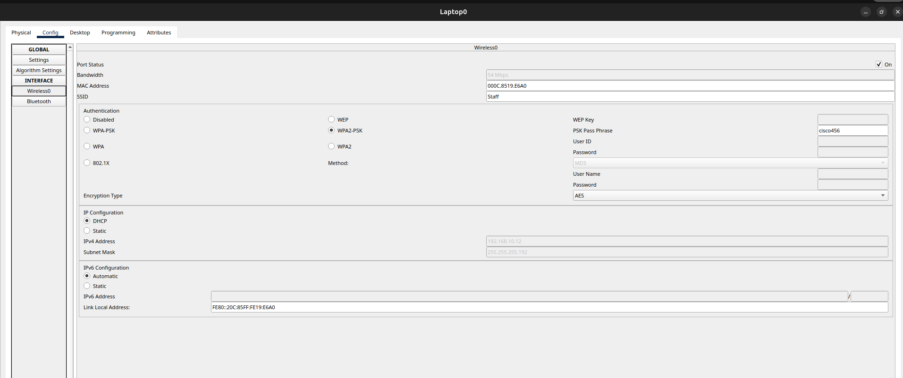

# Infrastructure Réseau d'Entreprise Sécurisée avec Interconnexion WAN (Cisco Packet Tracer)

  

## 📌 Présentation du Projet
Ce projet consiste en la conception, la configuration et la sécurisation d'une infrastructure réseau d'entreprise complète et simulée sous **Cisco Packet Tracer**. 

L'architecture met en place une segmentation par VLANs, un routage inter-VLAN géré par un commutateur de niveau 3 (Multilayer Switch), de la redondance de liens (EtherChannel), des services réseau centralisés (DHCP), ainsi qu'une interconnexion WAN sécurisée vers un Fournisseur d'Accès Internet (FAI) pour simuler l'accès à un serveur web public.

---

## 🗺️ Topologie Réseau & Segmentation
Le réseau de l'entreprise est segmenté en plusieurs zones logiques afin d'assurer l'étanchéité et la sécurité des flux :

* **🔹 VLAN 10 - Admin / Staff (Hybride) :** Réseau principal destiné au personnel administratif. Il regroupe les postes fixes en filaire et les ordinateurs portables via une borne Wi-Fi dédiée (`192.168.10.0/26`).
* **🔹 VLAN 11 - Comptabilité :** Zone filaire strictement dédiée au service comptable (`192.168.10.64/27`).
* **🔹 VLAN 20 - Guest (Wi-Fi) :** Réseau sans fil totalement isolé pour les invités et visiteurs de l'entreprise (`192.168.20.0/27`).
* **🔹 VLAN 99 - Management :** Dédié à l'administration sécurisée (SSH) des équipements réseaux (`192.168.99.0/28`).
* **🔹 VLAN 999 - Native VLAN :** Utilisé pour sécuriser les liaisons trunks et éviter les attaques de type *VLAN Hopping*.

---

## 🛠️ Technologies & Protocoles Implémentés

### 1. Commutation & Haute Disponibilité (Couche 2)
* **EtherChannel (LACP) :** Agrégation de liens physiques en mode `active` (Port-channel 1 et 2) entre le commutateur central L3 et les commutateurs d'accès pour augmenter la bande passante et offrir une tolérance aux pannes.
* **Trunking Dot1Q :** Configuration des interconnexions avec élagage (*VLAN pruning*) et assignation d'un VLAN natif non utilisé (VLAN 999).
* **Spanning-Tree (PVST+) :** Optimisation de la convergence réseau et prévention des boucles de commutation.

### 2. Routage & Services Réseau (Couche 3)
* **Routage Inter-VLAN :** Configuré directement sur le switch `Central-L3` via des interfaces virtuelles de commutateur (SVI).
* **Routage Statique :** * Configuration d'une route par défaut (`0.0.0.0/0`) sur le réseau d'entreprise pointant vers le routeur de bordure (`R1`), puis vers le `Router_FAI`.
  * Configuration de routes statiques de retour sur le routeur FAI pour joindre les sous-réseaux internes de l'entreprise.
* **DHCP Centralisé :** Le switch L3 distribue automatiquement les adresses IP aux clients des VLANs 10, 11 et 20, avec une exclusion stricte des premières adresses réservées aux passerelles.

### 3. Sécurité de l'Infrastructure (Hardening)
* **Port-Security (Sticky MAC) :** Activé sur les commutateurs d'accès pour mémoriser dynamiquement l'adresse MAC des postes légitimes. En cas de branchement d'un équipement inconnu, la violation est définie sur `restrict`.
* **STP PortFast & BPDU Guard :** Appliqués sur tous les ports d'accès utilisateurs afin d'accélérer la connexion des machines et de bloquer l'introduction de commutateurs pirates.
* **Administration Sécurisée (SSH v2) :** Désactivation du protocole non chiffré Telnet. L'accès en CLI se fait exclusivement via **SSHv2** avec authentification locale sur le VLAN 99.
* **Sécurité Wi-Fi :** Configuration des points d'accès sans fil (`AccessPoint0` pour le Staff et `AccessPoint1` pour les Guests) avec des SSIDs distincts et le protocole de chiffrement robuste **WPA2-PSK (AES)**.

---

## 📸 Tests de Validation & Preuves de Fonctionnement

### 1. Connectivité de bout en bout (Ping)
Validation des communications montrant qu'un PC du réseau interne de l'entreprise (ex: VLAN 10) arrive à joindre avec succès le serveur du FAI (`8.8.8.2`) :

  

### 2. Traceroute
Voir les sauts de route pour atteindre le serveur FAI (ex: VLAN 10) arrive à joindre avec succès le serveur du FAI (`8.8.8.2`) :

  

### 3. Sécurisation des accès à distance (SSH)
Démonstration de la connexion à l'un des commutateurs ou routeurs via SSHv2 depuis le VLAN de management 99, prouvant que Telnet est rejeté et que l'authentification locale fonctionne :

  

### 4. Association et Connectivité Wi-Fi (Staff & Guest)
Preuve de la bonne association des ordinateurs portables (Laptops) aux points d'accès correspondants avec chiffrement AES, et obtention d'une IP via DHCP dans leurs VLANs respectifs :

  

---

## 📊 Plan d'Adressage IP

| Zone / Équipement | VLAN | Réseau / IP | Masque | Passerelle (SVI / Interface) |
| :--- | :---: | :--- | :--- | :--- |
| **💼 Admin / Staff (Filaire + Wi-Fi)** | 10 | `192.168.10.0/26` | `255.255.255.192` | `192.168.10.1` |
| **🧮 Comptabilité** | 11 | `192.168.10.64/27` | `255.255.255.224` | `192.168.10.65` |
| **🔑 Guests (Wi-Fi)** | 20 | `192.168.20.0/27` | `255.255.255.224` | `192.168.20.1` |
| **🛠️ Management** | 99 | `192.168.99.0/28` | `255.255.255.240` | `192.168.99.1` |
| **🔗 Lien R1 $\leftrightarrow$ Central-L3** | — | `192.168.99.16/30` | `255.255.255.252` | Interconnexion |
| **🌐 Lien WAN (R1 $\leftrightarrow$ FAI)** | — | `203.0.113.0/30` | `255.255.255.252` | Interconnexion |
| **🖥️ Serveur Internet / DNS**| — | `8.8.8.0/30` | `255.255.255.252` | Serveur IP: `8.8.8.2` |

---

## 📁 Structure du Dépôt
* 📁 `configs/` : Contient les sauvegardes textuelles des fichiers de configuration (`running-config`) de chaque équipement.
* 📁 `img/` : Contient l'ensemble des captures d'écran des tests et validations réseau.
* 📄 `cisco-entreprise-network-architecture.pkt` : Le fichier de simulation Cisco Packet Tracer source.
